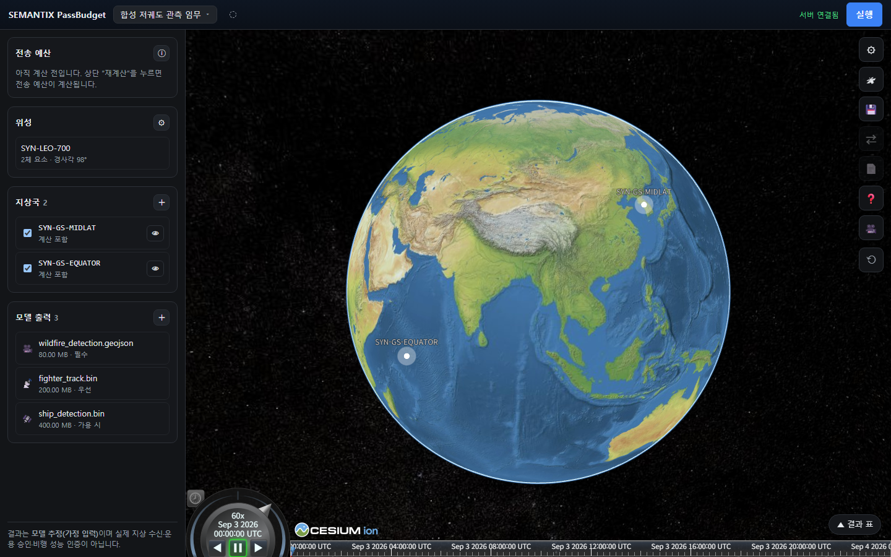

<p align="center">
  
</p>

# SEMANTIX PassBudget

[한국어](README.md) | [English](README_EN.md)

> 제한된 위성 접촉 시간 안에서 **얼마나 보낼 수 있고, 무엇을 먼저 보낼지** 판단하는 오픈소스 다운링크 계획 도구입니다.



## 개요

| 입력 | 계산 | 결과 |
|---|---|---|
| 궤도·지상국·통신 가정 | 접촉창·패스별 용량·전송 순서 | 전송 예산·완료량·잔여량·판단 근거 |

서로 다른 가정을 시나리오로 저장하고 비교할 수 있으며, 결과는 실제 수신 보장이 아닌 검토 가능한 계획 추정치로 제시됩니다.

## 무엇을 할 수 있나요?

| 기능 | 얻는 결과 |
|---|---|
| 궤도와 지상국 구성 | AOS/LOS, 접촉 시간, 최대 앙각 |
| 통신 조건 입력 | 패스별·기간별 전송 가능 용량 |
| 데이터 장바구니 | 우선순위에 따른 완료·부분 전송·미전송 |
| 시나리오 비교 | 지상국, 전송률, 정책 변경 전후의 차이 |

## 누구에게 유용한가요?

| 사용자 | 활용 방법 |
|---|---|
| 위성·미션 설계팀 | 불완전한 초기 사양을 비교 가능한 가정으로 관리 |
| 온보드 AI·탑재체팀 | 모델 산출물을 실제 전송 예산과 연결 |
| 지상국·통신팀 | 지상국 수, 데이터율, 접촉 시간이 전달량에 미치는 영향 확인 |

## 사용 방법

### 1. 저장소와 실행 환경 준비

Python 3.12와 Node.js가 필요합니다. 기본 저장소는 SQLite이므로 별도 데이터베이스 서버 없이 실행할 수 있습니다.

```bash
git clone https://github.com/l8whale8l/SEMANTIX-PassBudget.git
cd SEMANTIX-PassBudget
python -m venv .venv
```

```bash
# Windows
.venv\Scripts\python -m pip install -e ".[dev]"

# Linux / macOS
source .venv/bin/activate
python -m pip install -e ".[dev]"
```

### 2. 계산 엔진 확인

```bash
passbudget verify-golden
passbudget run PB-GOLDEN-ORB-01 --output result.json
```

CLI와 웹 API는 같은 계산 경로를 사용합니다. 첫 명령은 고정된 기준 시나리오의 결과가 변하지 않았는지 확인하고, 두 번째 명령은 결과를 JSON으로 저장합니다.

### 3. 웹 화면 실행

터미널 1에서 API를 실행합니다.

```bash
uvicorn semantix_passbudget.interfaces.api.app:app --host 127.0.0.1 --port 8000
```

터미널 2에서 웹 화면을 실행합니다.

```bash
cd frontend
npm ci
npm run dev
```

브라우저에서 `http://localhost:5173`을 엽니다.

### 4. 시나리오 계산

| 순서 | 작업 |
|---:|---|
| 1 | 공개 합성 프리셋을 불러오거나 새 시나리오를 만듭니다. |
| 2 | 궤도, 지상국 좌표, 최소 앙각과 분석 기간을 입력합니다. |
| 3 | 데이터율, 유효율과 안전계수를 입력합니다. |
| 4 | 전송할 데이터의 크기, 우선순위, 마감과 분할 방식을 정합니다. |
| 5 | 실행 후 패스별 용량, 전송 완료량과 잔여량을 확인합니다. |
| 6 | 가정을 바꾼 시나리오를 다시 실행하고 결과를 비교합니다. |

### 5. 결과 해석

| 표시 | 의미 |
|---|---|
| 전송 예산 | 선택된 접촉 일정에서 사용할 수 있는 총 용량 |
| 후보 용량 | 접촉 충돌을 정리하기 전의 이론상 합계 |
| 할당량 | 계획상 전송하도록 배정된 데이터 크기 |
| 잔여량 | 기간 안에 보내지 못한 데이터 크기 |
| `EXACT` | 정의된 조건에서 전역 최적해임을 확인한 결과 |
| `APPROXIMATE` | 실행 가능한 결정론적 근사 결과이며 전역 최적은 보장하지 않음 |

## 연산 엔진 검증

| 방법 | 결과 |
|---|---|
| 제품 엔진과 NASA GMAT R2026a를 고정 입력으로 독립 비교 | 58개 패스 일치, 허용 기준 위반 0건 |
| 사전에 정한 오차 상한으로 AOS·LOS·지속시간·최대앙각 검사 | 최악 오차: AOS 0.017초, LOS 0.014초, 지속시간 0.026초, 최대앙각 0.0051° |

이 검증은 정의된 시험 문제에서 구현 간 일치를 확인한 것이며, 특정 위성·무선 링크의 실제 성능을 인증하지 않습니다.

## 만든 팀

**SEMANTIX**는 전남대학교와 국민대학교 학부생으로 구성된 대한민국 학생 엔지니어링 팀입니다.
위성 임무팀이 제한된 통신 자원을 근거 있게 비교하도록 돕는 작고 검증 가능한 도구를 만듭니다.

## 공개 저장소 원칙

공개 기여에는 비공개 임무명·사양·좌표, 자격 증명과 서버 정보를 포함하지 마세요.
예제는 공개 출처 또는 합성 데이터를 사용하고, 가정값은 결과에서 명확히 구분해야 합니다.

## 라이선스

[MIT License](LICENSE)로 공개합니다.
